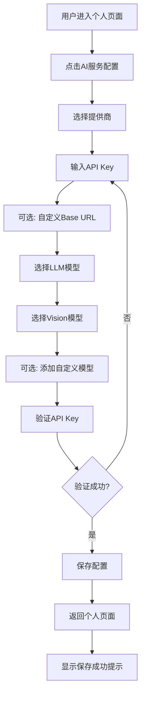
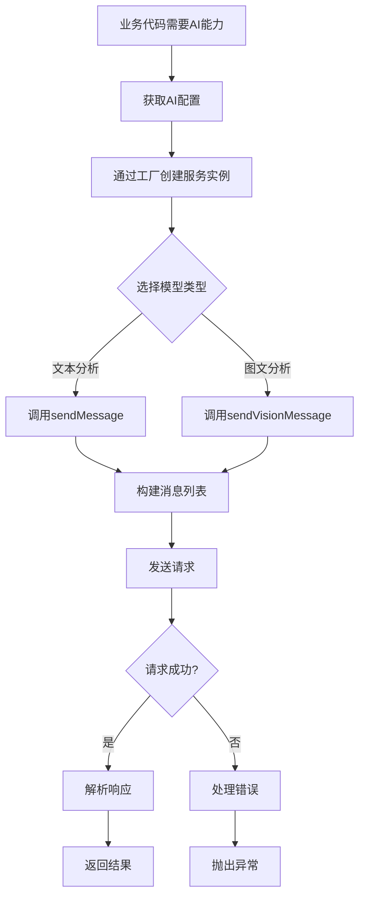
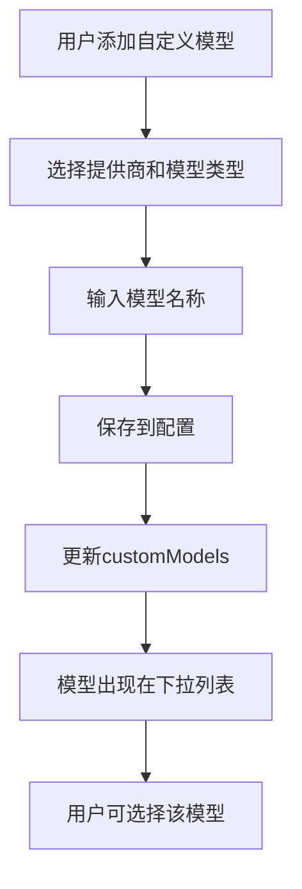

# AI能力使用文档

## 目录

1. [概述](#概述)
2. [业务流程](#业务流程)
3. [技术架构](#技术架构)
4. [接口API文档](#接口api文档)
5. [使用示例](#使用示例)
6. [错误处理](#错误处理)
7. [最佳实践](#最佳实践)

---

## 概述

本应用集成了AI大语言模型和多模态分析能力，支持通过HTTP接口调用外部AI服务提供商（DashScope、SiliconFlow）的LLM和Vision模型，为用户提供智能化的财务分析和数据理解能力。

### 核心功能

- **大语言分析（LLM）**：文本生成、对话、数据分析
- **图文分析（Vision）**：多模态理解、图片内容分析
- **多提供商支持**：DashScope（阿里云）、SiliconFlow
- **自定义模型管理**：用户可添加和管理自定义模型
- **配置管理**：统一的配置界面和持久化存储

### 支持的提供商

| 提供商 | 说明 | 基础URL |
|--------|------|---------|
| DashScope | 阿里云通义千问 | `https://dashscope.aliyuncs.com/api/v1` |
| SiliconFlow | SiliconFlow AI平台 | `https://api.siliconflow.cn/v1` |

---

## 业务流程

### 1. 配置流程



### 2. 使用流程



### 3. 模型管理流程



---

## 技术架构

### 架构图

```
┌─────────────────────────────────────────────────────────────┐
│                         UI Layer                             │
│  ┌──────────────────────────────────────────────────────┐   │
│  │          AiConfigScreen (配置界面)                   │   │
│  └──────────────────────────────────────────────────────┘   │
└─────────────────────────────────────────────────────────────┘
                              │
                              ▼
┌─────────────────────────────────────────────────────────────┐
│                      Service Layer                            │
│  ┌──────────────────┐         ┌──────────────────────┐    │
│  │ AiConfigService  │         │  AiServiceFactory    │    │
│  │ (配置管理)        │────────▶│  (服务工厂)          │    │
│  └──────────────────┘         └──────────────────────┘    │
│                                      │                       │
│                                      ▼                       │
│  ┌──────────────────────────────────────────────────────┐   │
│  │              AiService (抽象接口)                     │   │
│  │  • sendMessage()                                     │   │
│  │  • sendVisionMessage()                               │   │
│  │  • validateApiKey()                                  │   │
│  │  • getAvailableLlmModels()                           │   │
│  │  • getAvailableVisionModels()                        │   │
│  └──────────────────────────────────────────────────────┘   │
│         │                              │                     │
│         ▼                              ▼                     │
│  ┌──────────────┐            ┌──────────────────┐          │
│  │DashScopeAi   │            │SiliconFlowAi    │          │
│  │Service       │            │Service          │          │
│  └──────────────┘            └──────────────────┘          │
└─────────────────────────────────────────────────────────────┘
                              │
                              ▼
┌─────────────────────────────────────────────────────────────┐
│                      Model Layer                             │
│  ┌──────────────────────────────────────────────────────┐   │
│  │  AiConfig                                            │   │
│  │  • provider: AiProvider                             │   │
│  │  • apiKey: String                                    │   │
│  │  • llmModel: String?                                 │   │
│  │  • visionModel: String?                             │   │
│  │  • customModels: Map<String, List<String>>          │   │
│  └──────────────────────────────────────────────────────┘   │
│  ┌──────────────────────────────────────────────────────┐   │
│  │  AiMessage                                           │   │
│  │  • role: String                                      │   │
│  │  • content: String                                   │   │
│  │  • images: List<String>?                            │   │
│  └──────────────────────────────────────────────────────┘   │
│  ┌──────────────────────────────────────────────────────┐   │
│  │  AiResponse                                          │   │
│  │  • content: String                                   │   │
│  │  • model: String                                     │   │
│  │  • tokenUsage: TokenUsage?                          │   │
│  │  • finishReason: String?                            │   │
│  └──────────────────────────────────────────────────────┘   │
└─────────────────────────────────────────────────────────────┘
                              │
                              ▼
┌─────────────────────────────────────────────────────────────┐
│                    Infrastructure Layer                      │
│  ┌──────────────────┐         ┌──────────────────────┐    │
│  │  Dio HTTP Client │         │  SharedPreferences    │    │
│  │  (网络请求)       │         │  (配置持久化)         │    │
│  └──────────────────┘         └──────────────────────┘    │
└─────────────────────────────────────────────────────────────┘
                              │
                              ▼
                    ┌──────────────────┐
                    │  External APIs  │
                    │  • DashScope    │
                    │  • SiliconFlow  │
                    └──────────────────┘
```

### 核心组件说明

#### 1. AiConfigService（配置服务）

**职责**：管理AI配置的持久化存储

**位置**：`lib/core/services/ai/ai_config_service.dart`

**主要方法**：
- `getInstance()`: 获取单例实例
- `saveConfig(AiConfig)`: 保存配置
- `loadConfig()`: 加载配置
- `deleteConfig()`: 删除配置
- `hasConfig()`: 检查是否存在配置

**存储方式**：使用 `SharedPreferences` 存储JSON格式的配置

#### 2. AiServiceFactory（服务工厂）

**职责**：根据配置创建对应的AI服务实例

**位置**：`lib/core/services/ai/ai_service_factory.dart`

**主要方法**：
- `createService(AiConfig)`: 根据配置创建服务实例
- `createServiceWithProvider(...)`: 根据提供商创建默认配置的服务实例

**设计模式**：工厂模式 + 策略模式

#### 3. AiService（抽象接口）

**职责**：定义AI服务的统一接口

**位置**：`lib/core/services/ai/ai_service.dart`

**核心方法**：
- `sendMessage(...)`: 发送文本消息（LLM）
- `sendVisionMessage(...)`: 发送图文消息（Vision）
- `validateApiKey()`: 验证API Key
- `getAvailableLlmModels()`: 获取可用LLM模型列表
- `getAvailableVisionModels()`: 获取可用Vision模型列表

#### 4. DashScopeAiService / SiliconFlowAiService（具体实现）

**职责**：实现特定提供商的AI服务

**位置**：
- `lib/core/services/ai/dashscope_ai_service.dart`
- `lib/core/services/ai/siliconflow_ai_service.dart`

**特点**：
- 使用 `Dio` 进行HTTP请求
- 懒加载初始化（避免过早初始化错误）
- 统一的响应解析
- 详细的日志记录

---

## 接口API文档

### 1. AiService 接口

#### 1.1 sendMessage - 发送文本消息

**方法签名**：
```dart
Future<AiResponse> sendMessage({
  required List<AiMessage> messages,
  String? model,
  double? temperature,
  int? maxTokens,
  Map<String, dynamic>? extraParams,
});
```

**参数说明**：

| 参数 | 类型 | 必填 | 说明 |
|------|------|------|------|
| messages | `List<AiMessage>` | 是 | 消息列表，包含对话历史 |
| model | `String?` | 否 | 指定模型，不指定则使用配置中的默认模型 |
| temperature | `double?` | 否 | 温度参数（0.0-2.0），控制输出随机性 |
| maxTokens | `int?` | 否 | 最大生成token数 |
| extraParams | `Map<String, dynamic>?` | 否 | 额外的请求参数 |

**返回值**：`Future<AiResponse>`

**示例**：
```dart
final service = AiServiceFactory.createService(config);
final response = await service.sendMessage(
  messages: [
    AiMessage(role: 'system', content: '你是一个财务分析助手'),
    AiMessage(role: 'user', content: '分析一下我的月度支出'),
  ],
  temperature: 0.7,
  maxTokens: 1000,
);
print(response.content);
```

#### 1.2 sendVisionMessage - 发送图文消息

**方法签名**：
```dart
Future<AiResponse> sendVisionMessage({
  required List<AiMessage> messages,
  String? model,
  double? temperature,
  int? maxTokens,
  Map<String, dynamic>? extraParams,
});
```

**参数说明**：同 `sendMessage`

**特殊说明**：
- `AiMessage` 中的 `images` 字段用于传递图片URL列表
- 图片URL必须是可公开访问的URL

**示例**：
```dart
final response = await service.sendVisionMessage(
  messages: [
    AiMessage(
      role: 'user',
      content: '这张发票的金额是多少？',
      images: ['https://example.com/invoice.jpg'],
    ),
  ],
);
```

#### 1.3 validateApiKey - 验证API Key

**方法签名**：
```dart
Future<bool> validateApiKey();
```

**返回值**：`Future<bool>` - true表示有效，false表示无效

**示例**：
```dart
final isValid = await service.validateApiKey();
if (isValid) {
  print('API Key有效');
} else {
  print('API Key无效');
}
```

#### 1.4 getAvailableLlmModels - 获取可用LLM模型

**方法签名**：
```dart
List<String> getAvailableLlmModels();
```

**返回值**：`List<String>` - 模型名称列表

**示例**：
```dart
final models = service.getAvailableLlmModels();
print('可用模型: ${models.join(", ")}');
```

#### 1.5 getAvailableVisionModels - 获取可用Vision模型

**方法签名**：
```dart
List<String> getAvailableVisionModels();
```

**返回值**：`List<String>` - 模型名称列表

---

### 2. AiConfigService 接口

#### 2.1 getInstance - 获取服务实例

**方法签名**：
```dart
static Future<AiConfigService> getInstance();
```

**返回值**：`Future<AiConfigService>` - 单例实例

**示例**：
```dart
final configService = await AiConfigService.getInstance();
```

#### 2.2 saveConfig - 保存配置

**方法签名**：
```dart
Future<void> saveConfig(AiConfig config);
```

**参数说明**：

| 参数 | 类型 | 说明 |
|------|------|------|
| config | `AiConfig` | AI配置对象 |

**示例**：
```dart
final config = AiConfig(
  provider: AiProvider.dashscope,
  apiKey: 'your-api-key',
  llmModel: 'qwen-max',
  visionModel: 'qwen-vl-max',
  createdAt: DateTime.now(),
  updatedAt: DateTime.now(),
);
await configService.saveConfig(config);
```

#### 2.3 loadConfig - 加载配置

**方法签名**：
```dart
Future<AiConfig?> loadConfig();
```

**返回值**：`Future<AiConfig?>` - 配置对象，不存在则返回null

**示例**：
```dart
final config = await configService.loadConfig();
if (config != null) {
  print('已加载配置: ${config.provider}');
}
```

#### 2.4 deleteConfig - 删除配置

**方法签名**：
```dart
Future<void> deleteConfig();
```

**示例**：
```dart
await configService.deleteConfig();
```

#### 2.5 hasConfig - 检查是否存在配置

**方法签名**：
```dart
Future<bool> hasConfig();
```

**返回值**：`Future<bool>` - true表示存在，false表示不存在

---

### 3. AiServiceFactory 接口

#### 3.1 createService - 创建服务实例

**方法签名**：
```dart
static AiService createService(AiConfig config);
```

**参数说明**：

| 参数 | 类型 | 说明 |
|------|------|------|
| config | `AiConfig` | AI配置对象 |

**返回值**：`AiService` - AI服务实例

**示例**：
```dart
final config = await configService.loadConfig();
if (config != null) {
  final service = AiServiceFactory.createService(config);
  // 使用service...
}
```

#### 3.2 createServiceWithProvider - 使用提供商创建服务

**方法签名**：
```dart
static AiService createServiceWithProvider(
  AiProvider provider,
  String apiKey, {
  String? baseUrl,
});
```

**参数说明**：

| 参数 | 类型 | 必填 | 说明 |
|------|------|------|------|
| provider | `AiProvider` | 是 | 服务提供商 |
| apiKey | `String` | 是 | API Key |
| baseUrl | `String?` | 否 | 自定义基础URL |

**示例**：
```dart
final service = AiServiceFactory.createServiceWithProvider(
  AiProvider.dashscope,
  'your-api-key',
  baseUrl: 'https://custom-url.com',
);
```

---

### 4. 数据模型

#### 4.1 AiConfig

**位置**：`lib/core/models/ai_config.dart`

**属性**：

| 属性 | 类型 | 说明 |
|------|------|------|
| provider | `AiProvider` | 服务提供商 |
| apiKey | `String` | API密钥 |
| baseUrl | `String?` | 自定义基础URL |
| enabled | `bool` | 是否启用 |
| llmModel | `String?` | 默认LLM模型 |
| visionModel | `String?` | 默认Vision模型 |
| customModels | `Map<String, List<String>>` | 自定义模型列表 |
| createdAt | `DateTime` | 创建时间 |
| updatedAt | `DateTime` | 更新时间 |

**方法**：
- `getCustomLlmModels(AiProvider)`: 获取指定提供商的LLM模型列表
- `getCustomVisionModels(AiProvider)`: 获取指定提供商的Vision模型列表
- `copyWith(...)`: 复制并更新配置
- `toJson()`: 转换为JSON
- `fromJson(Map)`: 从JSON创建

#### 4.2 AiMessage

**位置**：`lib/core/models/ai_config.dart`

**属性**：

| 属性 | 类型 | 说明 |
|------|------|------|
| role | `String` | 角色：'user', 'assistant', 'system' |
| content | `String` | 消息内容 |
| images | `List<String>?` | 图片URL列表（用于Vision） |

**方法**：
- `toJson()`: 转换为JSON

#### 4.3 AiResponse

**位置**：`lib/core/models/ai_config.dart`

**属性**：

| 属性 | 类型 | 说明 |
|------|------|------|
| content | `String` | 响应内容 |
| model | `String` | 使用的模型 |
| tokenUsage | `TokenUsage?` | Token使用情况 |
| finishReason | `String?` | 完成原因 |

**方法**：
- `fromJson(Map)`: 从JSON创建

#### 4.4 TokenUsage

**位置**：`lib/core/models/ai_config.dart`

**属性**：

| 属性 | 类型 | 说明 |
|------|------|------|
| promptTokens | `int` | 输入Token数 |
| completionTokens | `int` | 输出Token数 |
| totalTokens | `int` | 总Token数 |

---

## 使用示例

### 示例1：基本文本对话

```dart
// 1. 加载配置
final configService = await AiConfigService.getInstance();
final config = await configService.loadConfig();

if (config == null) {
  print('请先配置AI服务');
  return;
}

// 2. 创建服务实例
final service = AiServiceFactory.createService(config);

// 3. 发送消息
final response = await service.sendMessage(
  messages: [
    AiMessage(role: 'user', content: '你好，请介绍一下你自己'),
  ],
);

// 4. 处理响应
print('AI回复: ${response.content}');
print('使用模型: ${response.model}');
if (response.tokenUsage != null) {
  print('Token使用: ${response.tokenUsage!.totalTokens}');
}
```

### 示例2：多轮对话

```dart
final service = AiServiceFactory.createService(config);

// 构建对话历史
final messages = <AiMessage>[
  AiMessage(
    role: 'system',
    content: '你是一个专业的财务顾问，擅长分析家庭财务状况。',
  ),
  AiMessage(
    role: 'user',
    content: '我这个月的支出是多少？',
  ),
];

// 第一轮对话
final response1 = await service.sendMessage(messages: messages);
print('AI: ${response1.content}');

// 添加AI回复到历史
messages.add(AiMessage(
  role: 'assistant',
  content: response1.content,
));

// 第二轮对话
messages.add(AiMessage(
  role: 'user',
  content: '那上个月呢？',
));

final response2 = await service.sendMessage(messages: messages);
print('AI: ${response2.content}');
```

### 示例3：图文分析

```dart
final service = AiServiceFactory.createService(config);

final response = await service.sendVisionMessage(
  messages: [
    AiMessage(
      role: 'user',
      content: '这张发票的总金额是多少？请列出明细。',
      images: [
        'https://example.com/invoice.jpg',
      ],
    ),
  ],
);

print('分析结果: ${response.content}');
```

### 示例4：使用自定义模型

```dart
// 使用配置中保存的自定义模型
final config = await configService.loadConfig();
final service = AiServiceFactory.createService(config!);

// 使用自定义LLM模型
final response = await service.sendMessage(
  messages: [
    AiMessage(role: 'user', content: '你好'),
  ],
  model: 'my-custom-model', // 指定自定义模型
);
```

### 示例5：验证API Key

```dart
final config = AiConfig(
  provider: AiProvider.dashscope,
  apiKey: 'your-api-key',
  createdAt: DateTime.now(),
  updatedAt: DateTime.now(),
);

final service = AiServiceFactory.createService(config);
final isValid = await service.validateApiKey();

if (isValid) {
  print('API Key有效，可以保存配置');
  await configService.saveConfig(config);
} else {
  print('API Key无效，请检查');
}
```

---

## 错误处理

### 异常类型

#### AiServiceException

**位置**：`lib/core/services/ai/ai_service.dart`

**属性**：

| 属性 | 类型 | 说明 |
|------|------|------|
| message | `String` | 错误消息 |
| statusCode | `int?` | HTTP状态码（如果有） |
| originalError | `dynamic` | 原始错误对象 |

**常见错误**：

1. **API Key无效**
   ```
   AiServiceException: DashScope请求失败: Unauthorized
   statusCode: 401
   ```

2. **网络错误**
   ```
   AiServiceException: DashScope请求失败: Connection timeout
   ```

3. **响应数据为空**
   ```
   AiServiceException: 响应数据为空
   ```

4. **模型不存在**
   ```
   AiServiceException: SiliconFlow请求失败: Model not found
   statusCode: 404
   ```

### 错误处理示例

```dart
try {
  final response = await service.sendMessage(
    messages: [AiMessage(role: 'user', content: '你好')],
  );
  print(response.content);
} on AiServiceException catch (e) {
  if (e.statusCode == 401) {
    print('API Key无效，请重新配置');
  } else if (e.statusCode == 404) {
    print('模型不存在，请检查模型名称');
  } else {
    print('请求失败: ${e.message}');
  }
} catch (e) {
  print('未知错误: $e');
}
```

---

## 最佳实践

### 1. 配置管理

- ✅ **在应用启动时加载配置**：避免每次使用时都加载
- ✅ **缓存服务实例**：如果配置不变，可以缓存服务实例
- ✅ **验证API Key**：保存配置前先验证API Key有效性
- ✅ **错误处理**：妥善处理配置加载失败的情况

```dart
// 好的实践：缓存配置和服务实例
class AiServiceManager {
  static AiConfig? _cachedConfig;
  static AiService? _cachedService;
  
  static Future<AiService?> getService() async {
    if (_cachedService != null && _cachedConfig != null) {
      return _cachedService;
    }
    
    final configService = await AiConfigService.getInstance();
    final config = await configService.loadConfig();
    
    if (config == null) {
      return null;
    }
    
    _cachedConfig = config;
    _cachedService = AiServiceFactory.createService(config);
    return _cachedService;
  }
  
  static void clearCache() {
    _cachedConfig = null;
    _cachedService = null;
  }
}
```

### 2. 消息构建

- ✅ **使用system角色设置上下文**：让AI理解角色和任务
- ✅ **保持对话历史**：多轮对话时保留历史消息
- ✅ **合理控制消息长度**：避免超出token限制

```dart
// 好的实践：构建清晰的消息结构
final messages = <AiMessage>[
  AiMessage(
    role: 'system',
    content: '你是一个财务分析助手，擅长分析家庭财务状况。',
  ),
  AiMessage(
    role: 'user',
    content: '分析一下我的月度支出情况。',
  ),
];
```

### 3. 性能优化

- ✅ **异步处理**：所有AI调用都是异步的，不要阻塞UI
- ✅ **超时设置**：合理设置请求超时时间
- ✅ **错误重试**：对于网络错误，可以实现重试机制

```dart
// 好的实践：异步处理 + 错误重试
Future<AiResponse> sendMessageWithRetry({
  required List<AiMessage> messages,
  int maxRetries = 3,
}) async {
  final service = await AiServiceManager.getService();
  if (service == null) {
    throw Exception('AI服务未配置');
  }
  
  for (int i = 0; i < maxRetries; i++) {
    try {
      return await service.sendMessage(messages: messages);
    } on AiServiceException catch (e) {
      if (e.statusCode != null && e.statusCode! >= 500 && i < maxRetries - 1) {
        // 服务器错误，重试
        await Future.delayed(Duration(seconds: i + 1));
        continue;
      }
      rethrow;
    }
  }
  throw Exception('重试次数已达上限');
}
```

### 4. 日志记录

- ✅ **记录关键操作**：记录请求和响应的关键信息
- ✅ **不记录敏感信息**：不要记录API Key等敏感信息
- ✅ **使用结构化日志**：便于后续分析和调试

```dart
// 好的实践：结构化日志
Log.business('AiService', '发送LLM请求', {
  'model': selectedModel,
  'messageCount': messages.length,
  'hasImages': messages.any((m) => m.images != null && m.images!.isNotEmpty),
});
```

### 5. 模型选择

- ✅ **根据场景选择模型**：LLM用于文本，Vision用于图文
- ✅ **使用配置中的默认模型**：简化调用代码
- ✅ **支持自定义模型**：允许用户添加自己的模型

```dart
// 好的实践：根据场景自动选择模型
Future<AiResponse> analyzeText(String text) async {
  final service = await AiServiceManager.getService();
  return await service.sendMessage(
    messages: [AiMessage(role: 'user', content: text)],
    // 不指定model，使用配置中的默认LLM模型
  );
}

Future<AiResponse> analyzeImage(String imageUrl) async {
  final service = await AiServiceManager.getService();
  return await service.sendVisionMessage(
    messages: [
      AiMessage(
        role: 'user',
        content: '分析这张图片',
        images: [imageUrl],
      ),
    ],
    // 不指定model，使用配置中的默认Vision模型
  );
}
```

---

## 附录

### A. 支持的模型列表

#### DashScope

**LLM模型**：
- `qwen-turbo` - 快速响应
- `qwen-plus` - 平衡性能
- `qwen-max` - 最强性能
- `qwen-max-longcontext` - 长上下文支持

**Vision模型**：
- `qwen-vl-plus` - 图文理解
- `qwen-vl-max` - 最强图文理解

#### SiliconFlow

**LLM模型**：
- `Qwen/Qwen2.5-72B-Instruct` - 72B参数
- `Qwen/Qwen2.5-32B-Instruct` - 32B参数
- `Qwen/Qwen2.5-14B-Instruct` - 14B参数
- `Qwen/Qwen2.5-7B-Instruct` - 7B参数
- `deepseek-ai/DeepSeek-V3` - DeepSeek V3
- `meta-llama/Meta-Llama-3.1-70B-Instruct` - Llama 3.1

**Vision模型**：
- `Qwen/Qwen2-VL-7B-Instruct` - 7B参数
- `Qwen/Qwen2-VL-2B-Instruct` - 2B参数

### B. 文件结构

```
lib/
├── core/
│   ├── models/
│   │   └── ai_config.dart              # AI配置和数据模型
│   └── services/
│       └── ai/
│           ├── ai_service.dart         # AI服务抽象接口
│           ├── ai_service_factory.dart # 服务工厂
│           ├── ai_config_service.dart  # 配置服务
│           ├── dashscope_ai_service.dart # DashScope实现
│           └── siliconflow_ai_service.dart # SiliconFlow实现
└── screens/
    └── ai_config_screen.dart           # AI配置界面
```

### C. 相关文档

- [项目架构文档](../README.md)
- [开发规范](../.cursor/rules/flutter-development.mdc)
- [日志规范](../.cursor/rules/logging-format.mdc)

---

**文档版本**：v1.0  
**最后更新**：2025-01-13  
**维护者**：开发团队


